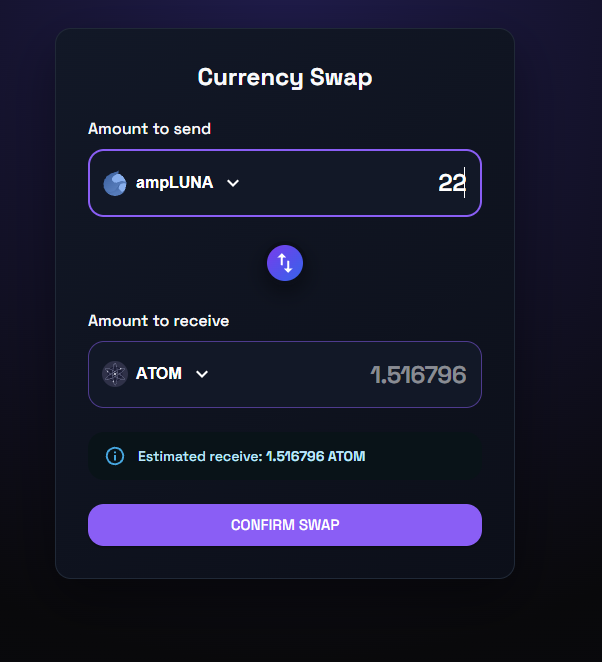
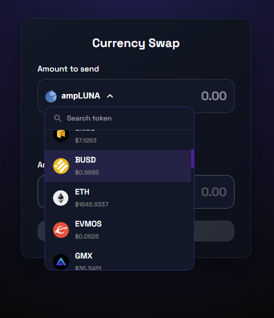

# Currency Swap

A simple currency swap application built with **React**, **TypeScript**, **Vite**, and **Material UI**. The application fetches live token prices, allows users to swap between currencies, and calculates the estimated receiving amount in real time.

## Tech Stack

- React 18
- TypeScript
- Vite
- Material UI 7
- Emotion

## Installation

```bash
npm install
npm run dev
```

## Build

```bash
npm run build
```

## Project Structure

```text
src/
├── components/
├── services/
├── types/
├── App.tsx
└── main.tsx
```



